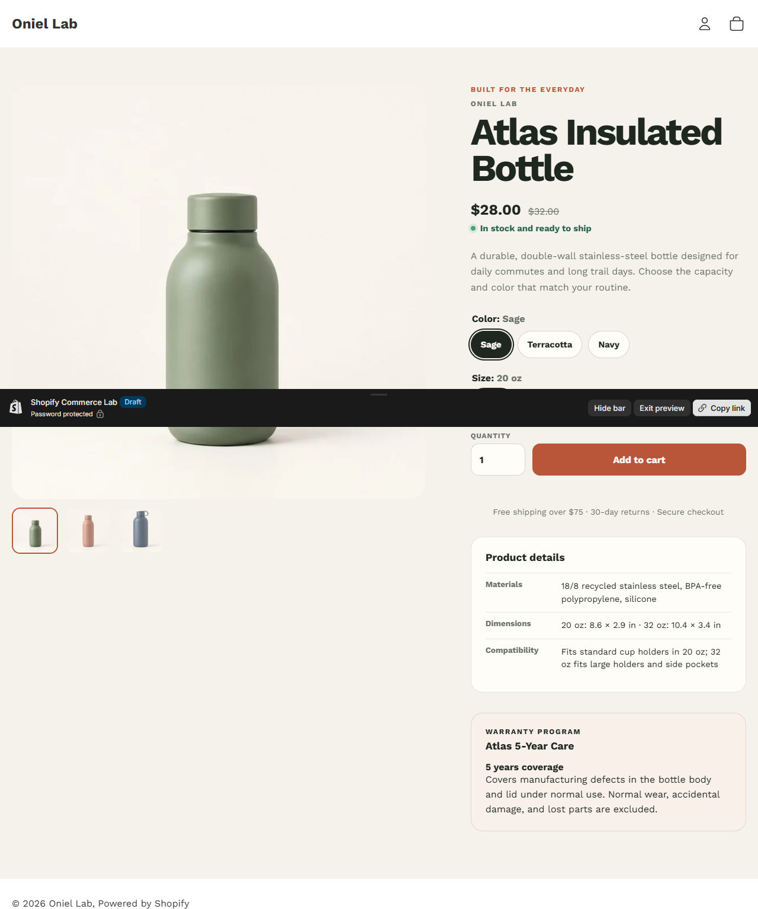

# Advanced Product Detail Page

## Problem and outcome

Shopify product-page work often fails at the seams between variants, media, inventory, structured data, and cart state. This independent module proves those behaviors against a real development-store product instead of a static mockup.

## Working evidence

- [Password-protected product preview](https://oniel-lab.myshopify.com/products/atlas-insulated-bottle?preview_theme_id=155175092398)
- [Advanced PDP source](../../theme/sections/product.liquid)
- [Product import data](../evidence/assets/phase-2-atlas-product.csv)
- [Desktop variant state](../shopify/assets/phase-2-variant-interaction.png) and [mobile product page](../shopify/assets/phase-2-mobile.png)
- [Browser test matrix](../test-results/phase-2-advanced-pdp.md)
- [60-second demo script](../evidence/phase-2-demo-script.md)

## Implementation

The Atlas Insulated Bottle has six real Shopify variants across Color and Size. Variant selection synchronizes price, compare-at price, assigned media, inventory messaging, hidden cart ID, option-state labels, and the `variant` URL parameter. The Sage / 32 oz variant is intentionally sold out and remains selectable so the unavailable state is visible without allowing purchase.

The add-to-cart form posts `FormData` to Shopify's Ajax Cart API without a page reload. It exposes a pending state, success link, server-error message, and a client-side quantity error. The cart test used Navy / 32 oz and the cart line URL retained variant ID `49379141714094`.

## Product data model

| Shopify object | Purpose | Evidence |
|---|---|---|
| Product | Shared title, description, vendor, media, and tags | `atlas-insulated-bottle` |
| Variant | Color/Size combination, price, inventory, SKU, assigned image | 6 variants |
| Product metafield `custom.materials` | Material specification | Rendered in Product details |
| Product metafield `custom.dimensions` | Size measurements | Rendered in Product details |
| Product metafield `custom.compatibility` | Fit guidance | Rendered in Product details |
| Product metafield `custom.warranty` | Reference to reusable warranty content | Links the product to the metaobject |
| `warranty_program` metaobject | Reusable title, coverage, and detailed terms | Atlas 5-Year Care entry |

The warranty is modeled as a metaobject because the same program can be referenced by multiple products while keeping coverage language in one merchant-managed record. The physical specifications remain product metafields because they belong to this product.

## Testing

- Shopify Theme Check: 40 files, zero offenses.
- Strict upload to unpublished theme succeeded.
- Sage / 20 oz: $28, sage media, available.
- Terracotta / 20 oz: $30, terracotta media, available.
- Terracotta / 32 oz: $40, terracotta media, available.
- Sage / 32 oz: $38, sage media, sold out, submit disabled.
- Navy / 32 oz: $40, navy media, available, correct AJAX cart line.
- Desktop preview and Shopify mobile preview visually reviewed.
- Quantity `0` produces an accessible inline error without submitting.
- Metafields and the linked warranty metaobject render from Shopify data.

See the [full validation matrix](../test-results/phase-2-advanced-pdp.md).

## Known limitations

- This is an unpublished, password-protected development-store theme, not a production storefront.
- Storefront preview remains password-protected; public screenshots and source are available above.
- The Skeleton theme's basic cart template does not print option names, so correctness was verified by the variant-specific cart URL and ID.
- No conversion, revenue, client, or traffic claims are made.

## Jobs supported

- Shopify product-page customization
- Variant, price, media, and availability synchronization
- Metafield-driven storefront content
- Metaobject modeling and rendering
- AJAX add-to-cart implementation
- Responsive PDP fixes
