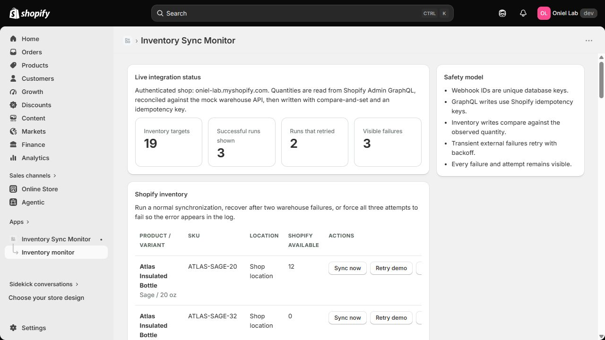
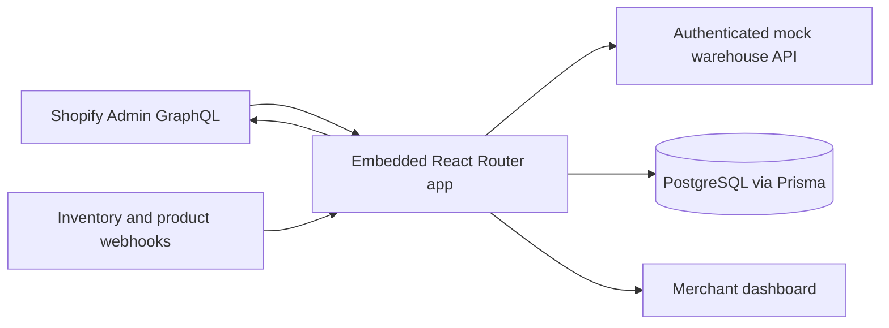

# Inventory Sync Monitor

An embedded Shopify app that reconciles inventory against an authenticated mock warehouse API and makes retries and failures inspectable. This is independent development-store work, not a production warehouse connector.

## Evidence at a glance

- [Live embedded app](https://admin.shopify.com/store/oniel-lab/apps/inventory-sync-monitor-2/app) — requires access to the Oniel Lab development store and an active Shopify CLI preview.
- [Retry/sync log](../shopify/assets/inventory-sync-retry.png) and [webhook deliveries](../shopify/assets/inventory-sync-webhooks.png) — captured from the actual Shopify admin, not generated images.
- [18-second evidence walkthrough](../shopify/assets/inventory-sync-evidence-walkthrough.mp4) — a sequence of those real screenshots, **not** a live screen recording.
- [GitHub repository](https://github.com/XonkelX/shopify-commerce-lab) and [app README](https://github.com/XonkelX/shopify-commerce-lab/tree/main/inventory-sync-monitor).
- Direct source: [embedded dashboard](https://github.com/XonkelX/shopify-commerce-lab/blob/main/inventory-sync-monitor/app/routes/app._index.tsx), [sync/GraphQL service](https://github.com/XonkelX/shopify-commerce-lab/blob/main/inventory-sync-monitor/app/services/inventory-sync.server.ts), [webhook claim logic](https://github.com/XonkelX/shopify-commerce-lab/blob/main/inventory-sync-monitor/app/services/webhook-events.server.ts), [Prisma models](https://github.com/XonkelX/shopify-commerce-lab/blob/main/inventory-sync-monitor/prisma/schema.prisma), and [integration proof](https://github.com/XonkelX/shopify-commerce-lab/blob/main/inventory-sync-monitor/scripts/run-integration-proof.ts).

## Problem and architecture

A merchant needs to see whether Shopify's available quantity matches a warehouse system and to understand what happened when synchronization fails. The app provides a small operational UI rather than a silent background script.

The official Shopify React Router app library authenticates embedded requests and verifies webhook delivery. The dashboard reads products, variants, locations, and available quantities through real Admin GraphQL. A webhook queries its exact inventory item and location independently of the dashboard's paginated list.

## Webhook, retry, and idempotency flow

1. Shopify delivers `inventory_levels/update` or `products/update`. The app stores the webhook ID as a unique PostgreSQL key, claims the event, and resolves the exact inventory target.
2. The app re-reads Shopify's quantity server-side. Manual requests never trust browser-submitted quantities.
3. It requests the target quantity from the mock warehouse. Transient errors retry up to three times with backoff; each attempt and final error are persisted.
4. When quantities match, it records `SKIPPED` and makes no mutation. This stopped the app's own inventory-update webhook from starting a write loop.
5. Otherwise `inventorySetQuantities` uses `changeFromQuantity` for compare-and-set and Shopify's `@idempotent` key. The app reads the exact item/location again after the mutation to verify the final available quantity.
6. A failed webhook may be reclaimed when Shopify retries it; processed IDs are ignored on repeat delivery. Concurrent duplicate-claim safety and duplicate sync-run suppression are covered by the PostgreSQL integration proof.

## Live verification — September 19, 2026

The app was linked, installed, and opened inside the Oniel Lab development-store admin. It read 19 live inventory targets through Admin GraphQL. An isolated QA product, `PHASE9-QA-001`, was active but unpublished to every sales channel and therefore not for sale. Its available quantity started at 4. A real inventory webhook triggered a GraphQL correction to the mock warehouse target of 16; the dashboard and Shopify inventory then showed 16. The follow-up webhook produced `SKIPPED 16 → 16`, demonstrating loop prevention.

The first live mutation exposed an Admin API `2026-07` input change: `InventoryQuantityInput` rejected the older `compareQuantity` field. Those failures remain visible in the dashboard. The implementation was corrected to `changeFromQuantity`, schema-validated, and the retried Shopify webhook succeeded. The same failed webhook ID was reclaimed and ultimately marked processed; a later inventory webhook was also processed. This is both a recorded failure state and a real recovery, not a cleaned-up mock log.

The manual “Retry demo” on the QA product returned 503 twice and a successful external quantity on attempt three. Because Shopify was already at 16, it recorded `SKIPPED 16 → 16` without another write. A separate “Failure demo” exhausted three 503 responses and left a visible `FAILED` run without changing inventory. The development store's operational Atlas products were not used for a successful sync write.

## Test notes

- `npm run typecheck`, `npm test` (5 unit tests), `npm run test:integration`, `npm run lint`, and `npm run build`: passed.
- `shopify app config validate --json`: valid app configuration.
- Shopify AI Toolkit schema validation: `inventorySetQuantities` input with `changeFromQuantity` accepted for Admin API `2026-07`.
- PostgreSQL integration proof: persisted retry attempts, safe duplicate webhook claim, failed-event reclaim, duplicate sync-run suppression, skip-on-no-change, and visible final failure. It uses a fake GraphQL responder and is **not** represented as a live Shopify webhook test.
- Live embedded UI: authenticated GraphQL read, controlled GraphQL mutation, real webhook deliveries, Shopify retry recovery, self-write skip, manual transient recovery, and visible final failure.

## Boundaries

The app runs through a Shopify CLI development tunnel; it is not deployed to durable production hosting. The warehouse is deterministic mock data, not a supplier integration. The UI lists the first 20 active products, up to 30 variants per product, and three locations per variant; webhook processing separately queries the exact item and up to 100 locations. Concurrent duplicate webhook delivery is covered by the database test, not an observed live race. The walkthrough is a screenshot sequence rather than an interaction recording. These limits support contained custom app and API projects, not enterprise inventory architecture or a production SLA.
