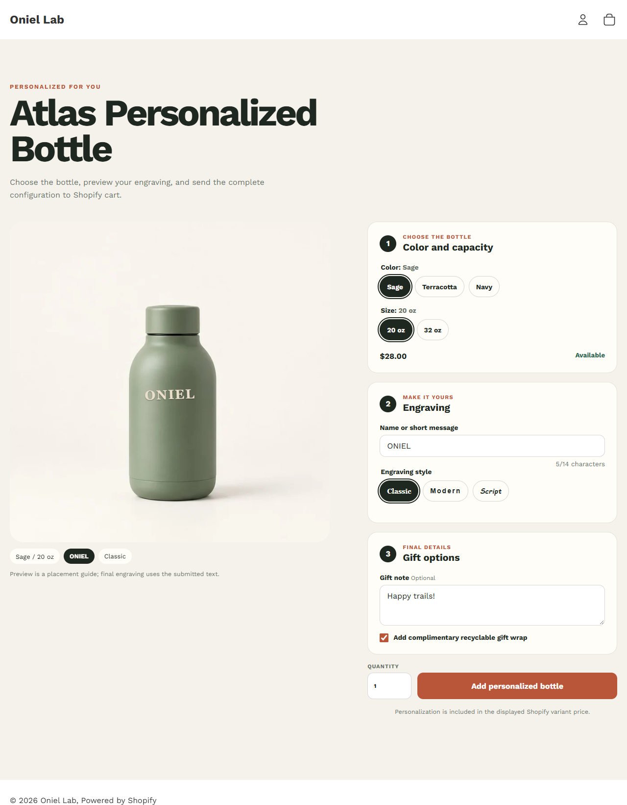

# Personalized Product Configurator



## Problem and outcome

Personalized products need more than a visual mockup: option choices must resolve to a real Shopify variant, invalid input must be blocked, and the customer's custom data must survive as line-item properties. This independent module proves that complete storefront-to-cart flow against a real development-store product.

## Working evidence

- [Password-protected configurator preview](https://oniel-lab.myshopify.com/products/atlas-personalized-bottle?preview_theme_id=155175092398&view=personalized)
- [Configurator source](../../theme/sections/product-configurator.liquid)
- [Personalized product template](../../theme/templates/product.personalized.json)
- [Cart property rendering](../../theme/sections/cart.liquid)
- [Browser test matrix](../test-results/phase-4-product-configurator.md)
- [Configuration-flow demo script](../evidence/phase-4-demo-script.md)
- [Mobile configurator](../shopify/assets/phase-4-personalized-mobile.png) and [cart properties](../shopify/assets/phase-4-personalized-cart.png)

## Solution

The Atlas Personalized Bottle configurator structures the flow into bottle selection, engraving, and gift details. Color and capacity resolve against six real Shopify variants. Price, availability, assigned media, selected option labels, the hidden variant ID, and the URL update together. The intentionally unavailable Sage / 32 oz combination remains visible as a sold-out state and cannot be submitted.

Personalization updates the bottle preview, character count, summary chips, and merchant-configured engraving style. Required text, allowed characters, quantity, and variant availability are validated before submission. The final native Shopify product form sends the selected variant and the following line-item properties:

- `Personalization`
- `Engraving style`
- `Gift note` when supplied
- `Gift wrap` when selected

The cart renders those properties with the exact Color and Size variant context. The verified flow used Navy / 32 oz, `ONIEL`, Script, `Happy trails!`, and gift wrap.

## Architecture

```text
Shopify product + variants + assigned media
                  ↓
Liquid product-configurator section
                  ↓
Browser state: options, live preview, validation, URL
                  ↓
Native Shopify product form submission
                  ↓
Variant ID + line-item properties
                  ↓
Cart Liquid renders variant options and personalization data
```

Merchant data is configured through the section schema: introductory copy, field labels, placeholder text, maximum characters, required/optional behavior, palette, and three reorderable engraving-style blocks. Variant price remains authoritative in Shopify; the module does not simulate client-side price changes.

## Testing

- Shopify Theme Check: 42 files, zero offenses.
- Strict upload to unpublished theme succeeded.
- Sage / 20 oz initializes at $28 and available.
- Navy / 32 oz resolves to $40, navy media, and available.
- Sage / 32 oz resolves to $38, sold out, and a disabled submit state.
- Empty personalization and unsupported characters show accessible inline errors.
- Quantity has a browser minimum plus a defensive JavaScript check.
- `ONIEL` updates the preview and 5/14 counter; Script changes the preview treatment.
- Native Shopify submission creates the correct Navy / 32 oz cart line.
- All four personalization properties render in cart.
- Desktop storefront and Shopify mobile preview were visually reviewed.
- Theme Editor exposes the section settings and all three style blocks.

See the [full validation matrix](../test-results/phase-4-product-configurator.md).

## Known limitations

- The evidence theme is unpublished and the development store is password protected.
- Shopify only lists alternate product templates from the published theme in the product-admin template picker. The configurator is therefore verified through the unpublished theme's `view=personalized` preview and is not assigned on the published theme.
- No image upload or dynamic-price surcharge is included. Personalization is included in the Shopify variant price so storefront and cart totals cannot diverge.
- Public screenshots cover the desktop, mobile, and cart-property states; the preview still requires store access.
- No production orders, conversion, revenue, or client outcomes are claimed.

## Jobs supported

- Contained Shopify product configurators
- Personalized product interfaces
- Advanced PDP option and validation flows
- Shopify line-item property implementation
- Responsive variant-selection experiences
- Merchant-configurable product modules
