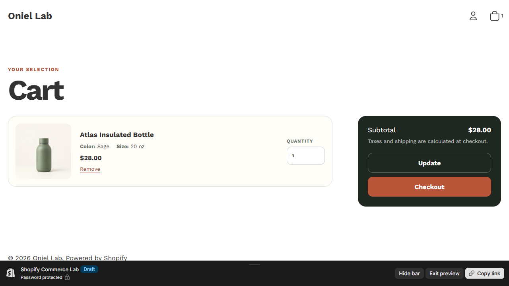

# Three Shopify theme repairs

Three concrete defects were reproduced, traced to code, repaired, and regression-tested in a real development store.

## What this proves

| Defect | Before — reconstructed pre-fix theme | After — repaired theme |
|---|---|---|
| AJAX cart count | [Add succeeded](assets/phase-3-before-ajax-count.jpg), but [header still showed 2](assets/phase-3-before-ajax-stale-header.jpg) while cart held 3 | [Header count updates](assets/phase-3-after-ajax-count.png) |
| Missing variant identity | [Cart showed title only](assets/phase-3-before-variant-cart.jpg) despite distinct variant IDs | [Selected options appear per line](assets/phase-3-after-variant-cart.png) |
| Invalid empty cart | [Checkout remained available](assets/phase-3-before-empty-cart.jpg) with no items | [Recovery link replaces Checkout](assets/phase-3-after-empty-cart.png) |

The before states were captured on 2026-09-19 from a separate unpublished **reconstruction** of pre-fix commit `31191e6` (`049ab5c^`). They are not historical screenshots from the original repair date. The after images show the repaired theme after subsequent presentation work, so the pairs compare behavior, not pixel-identical styling.

## Implementation and verification

- **Shopify stack:** Liquid, JavaScript, Ajax Cart API, cart sections, conditional rendering.
- **Verified:** reproduction, root cause, repair, and regression checks for all three defects. [Technical test notes](../test-results/phase-3-bug-fix-lab.md).
- **Code:** [header/cart count](../../theme/sections/header.liquid) · [variant and empty-cart rendering](../../theme/sections/cart.liquid).
- **Additional evidence:** [detailed case study and fix history](../case-studies/bug-fix-lab.md) · [captured-state clip](assets/bug-fix-lab-demo.mp4) (not a before/after recording).

## Preview and limits

[Open the repaired cart preview](https://oniel-lab.myshopify.com/cart?preview_theme_id=155175092398) — development-store access may be required. The reconstructed before states are explicitly labeled; no paid-client repair is claimed.

Relevant work: Liquid debugging, inherited-theme diagnosis, variant/cart state fixes, and empty-state repair. [See all Shopify evidence](README.md).
