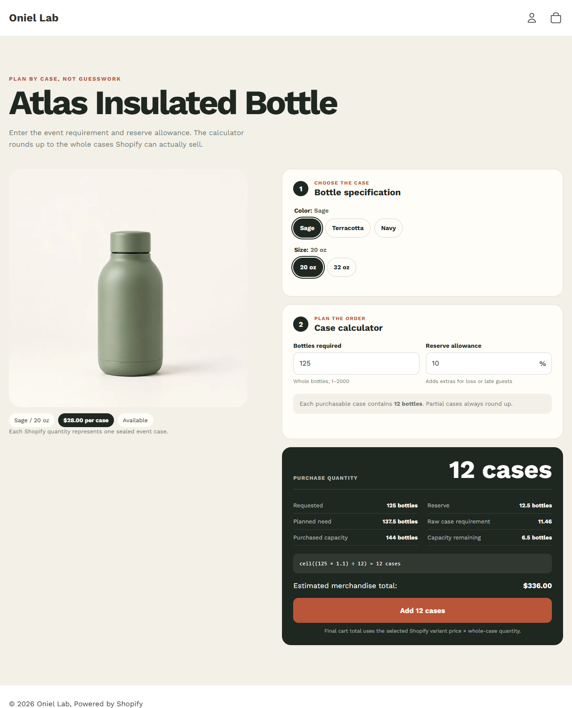

# Cart / Purchase Logic

**Problem proved:** Customer demand converts into whole purchasable cases with transparent ceiling math, validation, real variant availability, and auditable cart properties.

**Screenshot:** Verified 125-bottle plus reserve calculation state.

- **Live demo:** [Open the case calculator](https://oniel-lab.myshopify.com/products/atlas-insulated-bottle?preview_theme_id=155175092398&view=case-calculator)
- **Short demo video:** [Watch the 8-second calculation walkthrough](assets/cart-purchase-logic-demo.mp4)
- **Technologies:** Liquid, JavaScript, Shopify variants, Ajax Cart API, section rendering, native dialog.
- **Testing status:** PASS — exact and round-up boundaries, invalid ranges, sold-out blocking, quantity-12 cart submission, authoritative updates, removal, errors, empty state, mobile, and keyboard behavior verified. [Purchase-logic matrix](../test-results/phase-5-purchase-logic.md) · [Cart matrix](../test-results/phase-6-cart-engineering.md)
- **Relevant code:** [Calculator](../../theme/sections/purchase-logic-calculator.liquid) · [AJAX cart drawer](../../theme/sections/cart-drawer.liquid) · [Calculator template](../../theme/templates/product.case-calculator.json)
- **Jobs supported:** Quantity/purchase calculator, non-standard order logic, Ajax cart drawer, cart quantity/removal, loading/error/empty states.

[Purchase-logic case study](../case-studies/purchase-logic-calculator.md) · [Cart-engineering case study](../case-studies/cart-engineering.md) · [Back to Shopify evidence](README.md)
