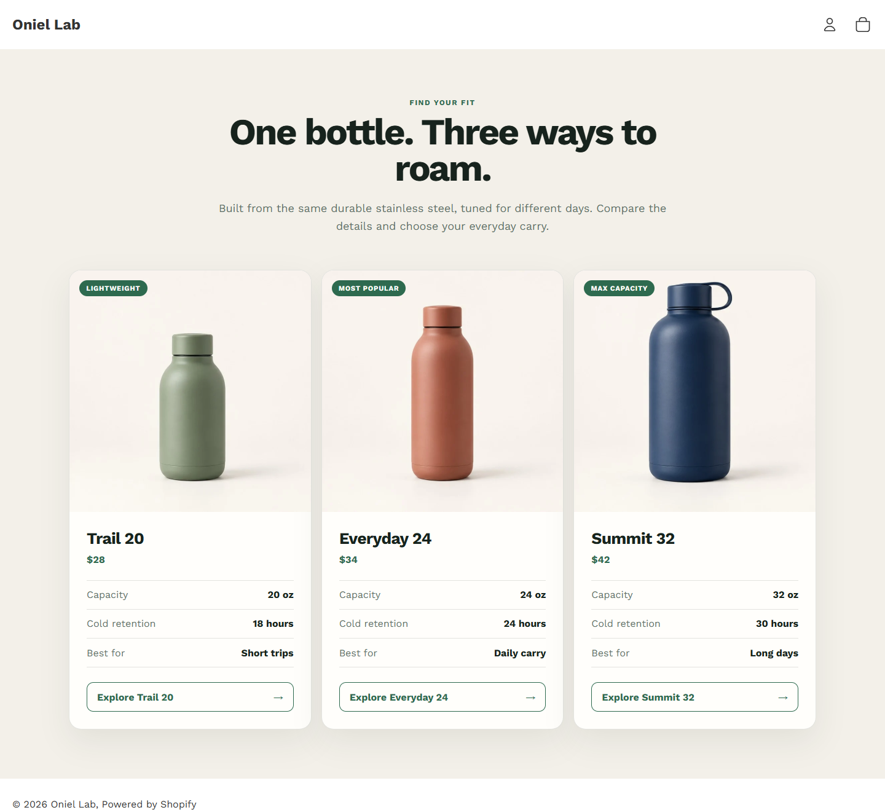

# Custom Section

**Problem proved:** A merchant can manage a responsive product-comparison section without editing Liquid.

**Screenshot:** Verified unpublished storefront state.

- **Live demo:** [Open the comparison section](https://oniel-lab.myshopify.com/?preview_theme_id=155175092398)
- **Short demo video:** [Watch the 8-second storefront walkthrough](assets/custom-section-demo.mp4)
- **Technologies:** Liquid, Online Store 2.0 section schema, responsive CSS, Shopify Theme Editor.
- **Testing status:** PASS — clean Theme Check plus desktop, mobile, block-order, add/remove, and editor-setting checks. [Validation matrix](../test-results/phase-1-product-comparison.md)
- **Relevant code:** [Section implementation](../../theme/sections/product-comparison.liquid) · [Homepage template](../../theme/templates/index.json)
- **Jobs supported:** Custom Shopify section, Liquid section edit, Theme Editor configuration, responsive theme fix.

[Detailed case study](../case-studies/product-comparison-section.md) · [Back to Shopify evidence](README.md)
