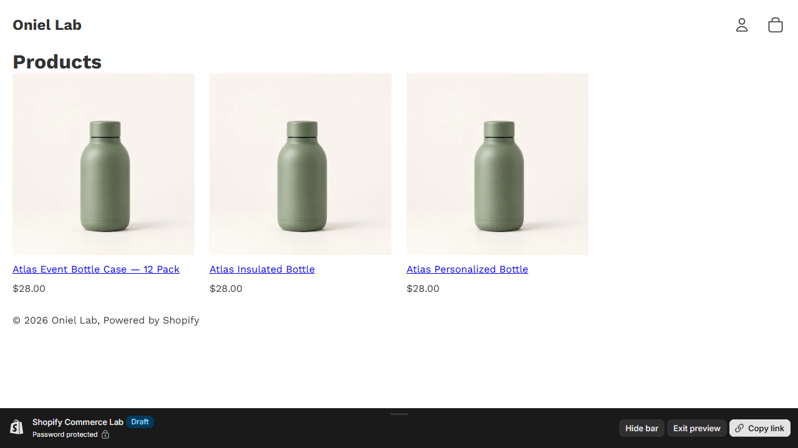

# Performance / QA

**Problem proved:** Theme quality is measured repeatably, findings are repaired, and limitations are reported without turning lab scores into production claims.

**Screenshot:** Verified collection route after the quality pass.

- **Live demo:** [Open the verified collection route](https://oniel-lab.myshopify.com/collections/all?preview_theme_id=155175092398)
- **Short demo video:** [Watch the 7-second QA-state walkthrough](assets/performance-qa-demo.mp4)
- **Technologies:** Shopify Theme Check, Lighthouse, PowerShell, GitHub Actions, Liquid, accessible native dialog patterns.
- **Testing status:** PASS — 45 theme files with zero Theme Check offenses; nine Lighthouse runs with three-run medians; keyboard, focus, dialog, live-error, contrast, touch-target, metadata, and responsive-image checks documented. [Quality matrix](../test-results/phase-7-quality.md)
- **Relevant code:** [CI workflow](../../.github/workflows/quality.yml) · [Local quality gate](../../scripts/verify-phase-7.ps1) · [Responsive image snippet](../../theme/snippets/image.liquid)
- **Jobs supported:** Shopify theme quality audit, Lighthouse/accessibility remediation, Theme Check, practical CI quality gates.

[Detailed case study](../case-studies/quality-engineering.md) · [Reproduction guide](../evidence/phase-7-reproduction.md) · [Back to Shopify evidence](README.md)
